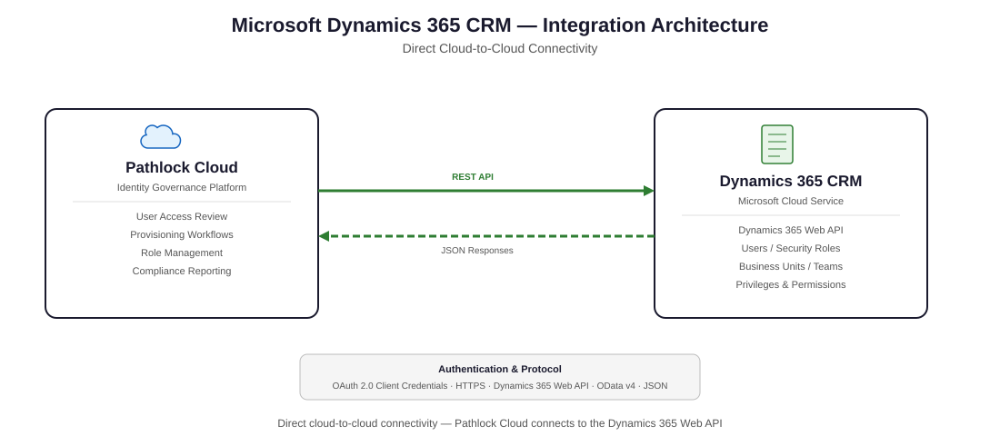

# 1. About This Guide
This guide explains how to deploy and configure the Pathlock Microsoft Dynamics 365 CRM connector in Pathlock Cloud. It covers prerequisites, supported operations, connection parameters, the steps required in Microsoft Entra ID and Microsoft Dynamics 365 CRM, installation through Source Onboarding or Classic Installation, validation, and troubleshooting.

## 1.1 Purpose

This guide describes what the connector supports, how to prepare the target Microsoft Dynamics 365 CRM environment, how to configure the connector in Pathlock Cloud, and how to validate the resulting configuration.

## 1.2 Audience

This guide is written for:
- **Pathlock administrators** configuring Dynamics 365 CRM as a Source in Pathlock Cloud.
- **Microsoft Dynamics 365 CRM administrators** responsible for users, security roles, teams, and field security profiles.
- **Microsoft Entra ID administrators** responsible for app registration, secrets, and admin consent.
- **IT operations and security teams** responsible for monitoring, scheduling, and troubleshooting.

## 1.3 Conventions Used in This Guide

This guide uses the following text conventions:

- **Bold** – Identifies UI elements, navigation paths, and menu options.
- *Italic* – Refers to document titles or placeholder values.
- `Inline code` – Highlights parameters, API endpoints, field names, and literal values.

----

# 2. Connector Overview
This section summarizes the connector's purpose and capabilities.

The connector integrates with the Microsoft Dynamics 365 Customer Engagement applications built on Microsoft Dataverse and the Power Platform. The following first-party Customer Engagement applications are covered:

- Microsoft Dynamics 365 **Sales**
- Microsoft Dynamics 365 **Customer Service**
- Microsoft Dynamics 365 **Field Service**
- Microsoft Dynamics 365 **Customer Insights – Journeys** (the product formerly known as Dynamics 365 Marketing)
- Microsoft Dynamics 365 **Project Operations** – Core (Lite) deployment, which is built on Dataverse and extends Dynamics 365 Sales. Existing Dynamics 365 **Project Service Automation (PSA)** environments are also covered, since PSA has been superseded by Project Operations on the same Dataverse platform.

Because these applications share the same Dataverse security model (System Users, Security Roles, Teams, Field Security Profiles, and Business Units), the same connector and configuration apply to any combination of them within a single Dynamics 365 environment.

> **Note:** Dynamics 365 **Finance and Operations** apps (Finance, Supply Chain Management, Commerce, Human Resources) and the **Project Operations** *Integrated with ERP* and *for manufacturing* deployments run on the Finance and Operations stack and are **not** covered by this connector. Those applications are governed by a separate Pathlock Cloud connector.

## 2.1 Connector Details

| Attribute | Value |
| --- | --- |
| Target Application | Microsoft Dynamics 365 CRM |
| Vendor | Microsoft |
| Connector Type | Target System |
| Connector Version | 2026.05.1 |
| Minimum Target Application Version | v9.0 |
| Minimum Pathlock Cloud Version | v2025.4.0 |
| Connectivity | Direct cloud-to-cloud (no agent required) |
| Authentication | OAuth 2.0 (Microsoft Entra ID, client credentials) |

## 2.2 Key Features
This section highlights the primary capabilities of the connector.
- OAuth 2.0 authentication through Microsoft Entra ID using a registered application and client secret.
- Reads Dynamics 365 CRM Users, Security Roles, Teams (Owner, Access, Office, Security), and Field Security Profiles.
- Reads role assignments for both bulk and single-user scenarios.
- Reads role content (privileges of Security Roles, members of Teams, and field permissions of Field Security Profiles) and activities.
- Provisioning support: assign and remove Security Roles, Owner Teams, and Field Security Profiles to/from users.
- User lifecycle management: lock, unlock, set user properties, and set user password (password reset uses Microsoft Graph).
- Custom operation to move a user to a different Business Unit.

## 2.3 Business Use Cases
This section lists the scenarios the connector is designed for.
- User Access Reviews and Segregation of Duties (SoD) analysis over Dynamics 365 CRM Security Roles, Teams, and Field Security Profiles.
- Centralized governance of CRM access from Pathlock Cloud.
- Privileged access monitoring for high-risk roles such as `System Administrator`.
- Automated user lifecycle and role assignment changes from Pathlock Cloud workflows.

----

# 3. Supported Systems and Versions

This section lists the minimum supported versions of the target application and Pathlock Cloud. For the list of in-scope Customer Engagement applications and the out-of-scope Finance and Operations apps, see [Connector Overview](#2-connector-overview).

| System | Minimum Supported Version |
| --- | --- |
| Microsoft Dynamics 365 CRM (Customer Engagement on Dataverse) | v9.0 |
| Pathlock Cloud | v2025.4.0 |

----

# 4. Integration Architecture
This section describes how the connector integrates with Microsoft Dynamics 365 CRM and Pathlock Cloud.

## 4.1 High-level Architecture Diagram

The following diagram shows the integration topology between Pathlock Cloud and Microsoft Dynamics 365 CRM.

## 4.2 Data Flow
This section explains the end-to-end data flow between systems.

1. Pathlock Cloud requests an OAuth 2.0 access token from Microsoft Entra ID using the registered application's client credentials and the configured tenant.
2. Microsoft Entra ID returns a bearer access token scoped to the target Dynamics 365 environment (and to Microsoft Graph for the password reset operation).
3. Pathlock Cloud calls the Dataverse Web API at `https://{your-instance}.crm{n}.dynamics.com/api/data/v9.1/` to read users, security roles, teams, field security profiles, role assignments, role content, and activities, and to perform attach/remove role and user lifecycle operations.
4. For the **Set User Password** operation, Pathlock Cloud calls Microsoft Graph (`https://graph.microsoft.com/{api version}/users/...`) instead of Dataverse.
5. The connector stages the responses, normalizes them according to the Pathlock security model, and loads them into Pathlock Cloud for downstream synchronization (Users, Roles, Authorizations).

## 4.3 Security Considerations
This section summarizes security controls and access principles.
- OAuth 2.0 client credentials flow with short-lived access tokens.
- Dynamics CRM Application User used as a non-interactive service identity.
- The Application User must be granted only the privileges required by the supported operations (least privilege).
- The client secret is stored as a sensitive parameter in Pathlock Cloud and is never displayed after configuration.
- All communication uses HTTPS.

----

# 5. Prerequisites
This section lists the prerequisites required before installing and configuring the connector.

## 5.1 System Requirements

- Microsoft Dynamics 365 CRM Online (version 9.0 or later).
- Pathlock Cloud `v2025.4.0` or later.
- Outbound HTTPS connectivity from Pathlock Cloud to:
  - `https://login.microsoftonline.com/`
  - `https://{your-instance}.crm{n}.dynamics.com/`
  - `https://graph.microsoft.com/` (required only for the Set User Password operation)

## 5.2 Access and Permissions Required

- A Microsoft Entra ID administrator who can register an application, create a client secret, add API permissions, and grant admin consent.
- A Microsoft Power Platform / Dynamics 365 administrator who can create the Application User and assign Security Roles and a Field Security Profile in the target environment.
- The Pathlock Cloud user who installs the connector must have access to the **Connectivity Hub** and **Marketplace** (for Source Onboarding) or **Technical Configuration > Connected Systems** (for Classic Installation).

## 5.3 Authentication and Authorization

The connector authenticates to Microsoft Dynamics 365 CRM using OAuth 2.0 (client credentials) with a Microsoft Entra ID app registration. A dedicated **Application User** in Dynamics 365 CRM is associated with the registered application and granted the required Dynamics CRM privileges. Detailed setup steps are provided in [Create an OAuth App in Microsoft Entra ID](#7-create-an-oauth-app-in-microsoft-entra-id), [Create an Application User in Dynamics 365 CRM](#8-create-an-application-user-in-dynamics-365-crm), and [Provide Access to the Application User](#9-provide-access-to-the-application-user).

----

# 6. Supported Operations, Features, and Capabilities
This section documents the operations and governance capabilities supported by the connector.

## 6.1 Supported Read Operations

| Operation | Supported |
| --- | --- |
| Read the list of users | Yes |
| Read the list of roles (Security Roles, Teams, Field Security Profiles) | Yes |
| Read the assignment of roles to users | Yes |
| Read role assignments for a single user | Yes |
| Read child roles (Teams to Security Roles / Field Security Profiles) | Yes |
| Read role content (privileges, team contents, field permissions) | Yes |
| Read activities list | Yes |
| Read detailed change logs | No |
| Read usage data | No |

## 6.2 Supported Provisioning Operations

| Operation | Supported |
| --- | --- |
| Assign role to user (Security Role, Owner Team, Field Security Profile) | Yes |
| Remove role from user (Security Role, Owner Team, Field Security Profile) | Yes |
| Lock user | Yes |
| Unlock user | Yes |
| Set user properties (first name, last name, email, city, country) | Yes |
| Set user password | Yes |
| Create user accounts | No |

## 6.3 Custom Operations

| Operation | Description |
| --- | --- |
| `UpdateUserBusinessUnit` | Moves a user to a different Business Unit in Dynamics 365 CRM. |

## 6.4 Multiple Role Types

The connector reads three distinct role types from Dynamics 365 CRM and exposes them to Pathlock Cloud as separate role types so they can be governed independently:

| Role Type | Source Entity | Notes |
| --- | --- | --- |
| Security Role | `roles` | Default role type. Subject to the Business Unit constraint at assignment time. |
| Team | `teams` | Includes Owner, Access, Office, Security, and the system-managed default Business Unit teams. Attach/remove through this connector is supported only for **user-created Owner Teams**. |
| Field Security Profile | `fieldsecurityprofiles` | Controls field-level access to sensitive attributes. |

Roles and Teams are exposed using the naming convention `{BusinessUnit}__{RoleName}` (or `{BusinessUnit}__{TeamName}`) so that names remain unique across Business Units. Field Security Profile names are expected to be unique across the instance and are exposed by name.

> **Note:** Every Business Unit in Dynamics 365 CRM has a system-managed **default Owner Team** whose name matches the Business Unit name. In the connector output these appear as `Team:{BusinessUnit}__{BusinessUnit}` (for example, `Team:Ivory Coast__Ivory Coast`). Membership of these default teams is implicit — a user is added or removed automatically when their Business Unit changes — and **cannot** be modified through `AddMembersTeam` / `RemoveMembersTeam`. To change a user's membership in a default Business Unit team, move the user to a different Business Unit using the [`UpdateUserBusinessUnit`](#1537-updateuserbusinessunit-custom) custom operation.

----

# 7. Create an OAuth App in Microsoft Entra ID

This section describes how to register a Microsoft Entra ID application that the connector uses to authenticate to Dynamics 365 CRM.

1. Sign in to https://portal.azure.com/ or https://entra.microsoft.com/ with an administrator account.
2. In the **Microsoft Entra ID** section, click **App registrations**.
3. Click **New registration**.
4. Enter a display name.
5. Choose the supported account types that match your tenancy.
6. Leave **Redirect URI** empty, or set any valid HTTPS URL (it is not used by the connector).
7. Click **Register**. Copy the **Application (client) ID** and **Directory (tenant) ID**. These become the **Oauth Client Id** and **Azure Tenant ID** connection parameters.
8. In the registered app, click **Certificates & secrets** > **Client secrets**.
9. Click **New client secret**, provide a description, choose an expiry window, and click **Add**. Copy the secret **value** immediately. This becomes the **Oauth Secret** connection parameter.
10. In the registered app, click **API permissions** and add the following permissions.
    - **Dynamics CRM** > **user_impersonation** (delegated). Required for all Dataverse Web API calls used by the connector.
    - **Microsoft Graph** > **User.ReadWrite.All** (application). Required only for the Set User Password operation.
    - **Microsoft Graph** > **User-PasswordProfile.ReadWrite.All** (application). Required only for the Set User Password operation.
11. Click **Grant admin consent** for your tenant to grant the permissions.

> **Note:** If the Set User Password operation will not be used, the two Microsoft Graph application permissions are not required.

----

# 8. Create an Application User in Dynamics 365 CRM

This section explains how to create the Application User in Dynamics 365 CRM. The Application User is a non-interactive service account that is associated with the Microsoft Entra ID app registration created in [Create an OAuth App in Microsoft Entra ID](#7-create-an-oauth-app-in-microsoft-entra-id) and is the identity under which the connector executes all Dataverse operations.

1. Navigate to https://admin.powerplatform.microsoft.com/environments and sign in as an administrator.
2. Click the target environment.
3. Click **Settings**.
4. Expand **Users + permissions**.
5. Click **Application Users**.
6. Click **New app user**.
7. Click **Add an app**.
8. Search for the application created in Microsoft Entra ID.
9. Click **Add**.
10. Select the appropriate Business Unit and click **Create**.

For reference, see https://learn.microsoft.com/en-us/power-platform/admin/manage-application-users#view-or-edit-the-details-of-an-application-user.

----

# 9. Provide Access to the Application User

This section lists the privileges that must be granted to the Application User in Dynamics 365 CRM so the connector can perform the supported operations.

1. Sign in to the Dynamics 365 CRM application as an administrator.
2. In **Settings**, click **Security**.
3. Click **Security Roles** and create a new Security Role with at least the following privileges.

   **Business Management**

   | Entity | Required Privileges |
   | --- | --- |
   | Business Unit | Read |
   | Mailbox | Read, Write |
   | Field Security Profile | Create, Read, Write, Delete, Append, Append To |
   | Security Role | Full access |
   | Team | Full access |
   | User | Full access |
   | User Settings | Full access |

   **Customization**

   | Entity | Required Privileges |
   | --- | --- |
   | Solution | Read |
   | System Application Metadata | Read |

4. Assign the new Security Role to the Application User.
5. Create a new **Field Security Profile** and add the following field permissions.

   | Field | Entity | Permissions |
   | --- | --- | --- |
   | `msdyn_securemsappsecret` | Bot Channel Registration Secret | Read, Update, Create |
   | `msdyn_clientsecret` | Integrated Search Provider | Read, Update, Create |

6. Assign the Field Security Profile to the Application User.

For the Dataverse privilege reference, see https://learn.microsoft.com/en-us/previous-versions/dynamicscrm-2016/developers-guide/hh547441(v=crm.8).

----

# 10. Connection Parameters
This section lists the connection and authentication parameters required by the connector. Values for the OAuth parameters come from the Microsoft Entra ID app registration described in [Create an OAuth App in Microsoft Entra ID](#7-create-an-oauth-app-in-microsoft-entra-id).

| Parameter | Required | Description |
| --- | --- | --- |
| **System Type** | Yes | Set to `Http Connector`. |
| **DataSource** | Yes | Base URL of your Dynamics 365 CRM instance, for example `https://{your-instance}.crm4.dynamics.com`. Do not include a trailing `/`. |
| **Oauth Client Id** | Yes | Application (client) ID of the registered Microsoft Entra ID application. |
| **Oauth Secret** | Yes | Client secret value generated for the Microsoft Entra ID application. Stored as a secret in Pathlock Cloud. |
| **Azure Tenant ID** | Yes | Directory (tenant) ID of the Microsoft Entra ID tenant that hosts the Dynamics 365 CRM environment. |
| **Graph API version** | Yes | Microsoft Graph API version to use for the Set User Password operation. Set to `v1.0` unless Microsoft directs otherwise. |

----

# 11. Connector Installation

This section describes the available installation methods and provides a high-level overview of the steps for each one.

## 11.1 Installation Methods
The connector supports two installation methods:

- **Source Onboarding (Marketplace)** – Available in Pathlock Cloud `v2026.1.0` or later.
- **Classic Installation (Manual Connector Package Upload)** – Used when Source Onboarding is not available (Pathlock Cloud versions earlier than `v2026.1.0`). For the detailed procedure, see [Classic Installation (Manual Connector Package Upload)](#192-classic-installation-manual-connector-package-upload--for-pathlock-cloud-versions-earlier-than-v202610) under Appendix.

## 11.2 Source Onboarding (Marketplace) – Pathlock Cloud v2026.1.0+
Use the Installation Wizard to create and configure a new Source through the Marketplace.

To start Source Onboarding, follow these steps.

1. Go to **Admin** > **Connectivity Hub** > **Marketplace**.
2. On the **Licensed** tab, locate and expand the connector card for Microsoft Dynamics 365 CRM.
3. Click **Installation Wizard**.

The **Guided Setup** opens. Complete the following steps.

1. **Deployment Type**
   - Enter the **Source Name**.
   - Select **On-Cloud**.
   - Click **Save & Continue**.
2. **Connection & Authentication**
   - Enter the connection and authentication parameters. For details, see [Connection Parameters](#10-connection-parameters).
   - Click **Save & Continue**.
3. **Additional Configuration**
   - Configure any connector-specific parameters. For details, see [Connection Parameters](#10-connection-parameters).
   - Click **Save & Continue**.
4. **Test Connection**
   - Click **Test Connection** to validate connectivity to Dynamics 365 CRM. For details, see [Test the Configuration](#12-test-the-configuration).
5. **Review**
   - Review the configuration summary and confirm the connection status.
   - Click **Finish** to complete onboarding.

The configured Source is created in **Active** status and can be accessed from **Admin** > **Connectivity Hub** > **Sources**.

----

# 12. Test the Configuration
This section describes how to validate connectivity and required permissions after configuring the Source.

The connector exposes a **Test Connection** operation in Pathlock Cloud that runs a set of test operations against Dynamics 365 CRM and Microsoft Graph and reports the result of each test.

| Test Operation | Description | Critical |
| --- | --- | --- |
| `Test_Verify_Credentials` | Verifies that authentication to Microsoft Entra ID succeeds. | Yes |
| `Test_Read_Users_List` | Reads a small page of users to validate the Users read operation. | Yes |
| `Test_Read_Role_List` | Reads small pages of Security Roles, Teams, and Field Security Profiles, plus their child-role relationships. | Yes |
| `Test_Read_User_Roles` | Reads role assignments to validate the User Roles operation. | Yes |
| `Test_Read_Activity_List` | Reads role privileges and field permissions to validate the Activities operation. | Yes |
| `Test_Update_User` | Validates the Set User Properties operation by performing a test update against a user. | Yes |

To run the tests:

1. Open the configured Source in Pathlock Cloud.
2. Click **Test Connection**.
3. Review the per-test result. If all critical tests pass, the connector is considered correctly configured.

> **Note:** `Test_Update_User` issues a write call to validate the update path. Use a non-production user for connection-test runs whenever possible.

----

# 13. Synchronizing the Microsoft Dynamics 365 CRM Source with Pathlock Cloud
This section explains how to schedule and run synchronization for the configured Source so Pathlock Cloud can ingest and reconcile connector data.

1. Complete all five steps in the connector setup wizard.
2. Navigate to **Admin** > **Connectivity Hub** > **Sources**.
3. Locate the created Source and verify that its status is **Successfully Completed**.
4. Click the **Expand** icon next to the completed Source.
5. Go to the **Process Schedule** tab.
6. Click **Actions** > **New** to create a new synchronization schedule.
7. In the configuration window, configure the schedule.
   - Select the **Source** from the drop-down list.
   - Choose the **Process**, such as *Synchronize Users*, *Synchronize Roles*, or *Synchronize Authorizations*.
   - Set the desired **Time Interval** for the process, such as *Daily*, *Weekly*, or *Custom*.
8. Click **Save** to activate the synchronization schedule. The selected synchronization process runs automatically at the configured intervals.

The recommended synchronization order for the initial run is: Synchronize Users, Synchronize Roles, Synchronize Authorizations.

----

# 14. Security Model Mapping
This section describes how Microsoft Dynamics 365 CRM objects map to the Pathlock Cloud security model.

- **Users**: System Users (`systemusers`).
- **Roles** (three role types):
  - **Security Roles** – Standard Dataverse roles.
  - **Teams** – Owner, Access, Office, and Security teams.
  - **Field Security Profiles** – Field-level access profiles.
- **Child Roles**:
  - Teams to Security Roles (roles assigned to a Team).
  - Teams to Field Security Profiles (profiles assigned to a Team).
- **Activities** (role content):
  - Privileges granted by Security Roles.
  - Field permissions granted by Field Security Profiles.

## 14.1 Naming Conventions

- Security Roles and Teams are exposed as `{BusinessUnit}__{RoleName}` so that role names are unique across Business Units.
- Activities under Field Security Profiles are exposed as `{EntityName}-{AttributeName}`.

## 14.2 Team Types

| Team Type | Description | Provisionable through this connector |
| --- | --- | --- |
| Owner Teams (user-created) | Carry privileges and can own records. | Yes |
| Default Business Unit Owner Teams | System-managed Owner Team that exists for every Business Unit and shares the Business Unit's name (for example, `Ivory Coast__Ivory Coast`). Membership is derived from the user's Business Unit assignment. | No (membership changes only by moving the user to a different Business Unit) |
| Access Teams | Provide record-level sharing; do not own records. | No |
| Office Teams | Collaboration teams that inherit permissions through Business Units and linked roles. | No (managed in Microsoft Entra ID) |
| Security Teams | Used for scoped security scenarios; typically mirror high-privilege role assignments. | No (managed in Microsoft Entra ID) |

> **Note:** Attach and Remove Role for Teams use the Dataverse `AddMembersTeam` and `RemoveMembersTeam` actions, which support only **user-created Owner Teams**. Office and Security Teams are backed by Microsoft Entra ID groups and must be managed there. The system-managed default Business Unit teams cannot be modified by `AddMembersTeam` / `RemoveMembersTeam` (or by plug-ins / workflows) — their membership is changed only by moving the user to a different Business Unit using the [`UpdateUserBusinessUnit`](#1537-updateuserbusinessunit-custom) custom operation.

## 14.3 Business Unit Constraint for Security Roles

Dataverse requires the user and the Security Role to be in the same Business Unit. If they differ, the API rejects the assignment. This constraint does **not** apply to Teams or Field Security Profiles.

## 14.4 Assumptions

The connector expects the following conditions in the target Dynamics 365 CRM environment:

- **One active account per user** – Each user has exactly one active account with a single Domain Name. Users with multiple occurrences under different Domain Names may produce unexpected results.
- **Unique Field Security Profile names** – Field Security Profile names are unique within the Dynamics 365 CRM instance.
- **Unique Role/Team per Business Unit** – Security Role and Team names are unique within their Business Unit.

----

# 15. Field Mapping Information
This section lists the field mappings between Dynamics 365 CRM and Pathlock Cloud.

## 15.1 Users
**API Endpoint:** `/api/data/v9.1/systemusers`

| Pathlock Cloud Field | API Field | Notes |
| --- | --- | --- |
| `ApiIdentifier` | `systemuserid` | Unique system user ID. |
| `UserName` | `domainname` (falls back to `systemuserid` for Users; falls back to `internalemailaddress` for Single User) | |
| `EMail` | `internalemailaddress` | |
| `FullName` | `fullname` | |
| `LockStatus` | derived from `isdisabled` | `1` -> `64` (locked); otherwise `0` (active). |
| `Department` | `businessunitid_name` | User's Business Unit name. |
| `Building` | `businessunitid_businessunitid` | Business Unit ID. |
| `CreateDate` | `createdon` | Formatted as `yyyy-MM-dd HH:mm:ss`. |
| `LastChange` | `modifiedon` | Formatted as `yyyy-MM-dd HH:mm:ss`. |
| `LastLogon` | `lastlogon` | Formatted as `yyyy-MM-dd HH:mm:ss`. |
| `Country` | `address1_country` | |
| `City` | `address1_city` | |

## 15.2 Roles

### 15.2.1 Security Roles
**API Endpoint:** `/api/data/v9.1/roles`

| Pathlock Cloud Field | API Field | Notes |
| --- | --- | --- |
| `RoleName` | `{businessunitid_name}__{name}` | Composite to keep role names unique across Business Units. |
| `RoleId` | `roleid` | |
| `CustomRoleType` | constant `SecurityRole` | |
| `Description` | `name` | |
| `RoleAttribute1` | `solution_role_uniquename` | Solution-level unique name. |
| `RoleAttribute2` | `businessunitid_name` | Business Unit of the role. |
| `CreateDate` | `createdon` | |
| `ChangeDate` | `modifiedon` | |
| `CreateBy` | `createdby_internalemailaddress` | |
| `ChangeBy` | `modifiedby_internalemailaddress` | |

### 15.2.2 Teams
**API Endpoint:** `/api/data/v9.1/teams`

| Pathlock Cloud Field | API Field | Notes |
| --- | --- | --- |
| `RoleName` | `{businessunitid_name}__{name}` | |
| `RoleId` | `teamid` | |
| `Description` | `name` | |
| `RoleAttribute2` | `businessunitid_name` | |
| `RoleType` | `teamtype` | Raw team type code (`0`–`3`). |
| `CustomRoleType` | derived from `teamtype` | `0` -> `OwnerTeam`, `1` -> `AccessTeam`, `2` -> `OfficeTeam`, `3` -> `SecurityTeam`. |
| `CreateDate` | `createdon` | |
| `ChangeDate` | `modifiedon` | |
| `CreateBy` | `createdby_internalemailaddress` | |
| `ChangeBy` | `modifiedby_internalemailaddress` | |

### 15.2.3 Field Security Profiles
**API Endpoint:** `/api/data/v9.1/fieldsecurityprofiles`

| Pathlock Cloud Field | API Field | Notes |
| --- | --- | --- |
| `RoleName` | `name` | |
| `RoleId` | `fieldsecurityprofileid` | |
| `CustomRoleType` | constant `FieldSecurityProfile` | |
| `Description` | `name` | |
| `RoleAttribute1` | `solution_role_uniquename` | |
| `CreateDate` | `createdon` | |
| `ChangeDate` | `modifiedon` | |
| `CreateBy` | `createdby_internalemailaddress` | |
| `ChangeBy` | `modifiedby_internalemailaddress` | |

## 15.3 Provisioning Operation Parameters

### 15.3.1 Attach Role
Assigns a role to a user. The same operation handles all three role types based on the role name resolved from the role list.

- Security Roles are associated through `systemuserroles_association`.
- User-created Owner Teams are added through the `AddMembersTeam` action.
- Field Security Profiles are associated through `systemuserprofiles_association`.

> **Note:** Default Business Unit Owner Teams (those that share the Business Unit's name, e.g. `Team:Ivory Coast__Ivory Coast`) cannot be assigned through this operation. Use [`UpdateUserBusinessUnit`](#1537-updateuserbusinessunit-custom) to change a user's default-team membership by moving the user to a different Business Unit.

| Parameter | Required | Description |
| --- | --- | --- |
| `username` | Yes | Domain Name of the user. |
| `rolename` | Yes | Role name exactly as returned by the Read Roles List operation. For Security Roles and Teams, use the `{BusinessUnit}__{RoleName}` form. |

### 15.3.2 Remove Role
Removes a role from a user. Mirrors Attach Role and uses the corresponding disassociate / `RemoveMembersTeam` calls.

> **Note:** Default Business Unit Owner Teams cannot be removed through this operation. Use [`UpdateUserBusinessUnit`](#1537-updateuserbusinessunit-custom) to remove a user from a default Business Unit team by moving the user to a different Business Unit.

| Parameter | Required | Description |
| --- | --- | --- |
| `username` | Yes | Domain Name of the user. |
| `rolename` | Yes | Role name exactly as returned by the Read Roles List operation. |

### 15.3.3 Lock User
Disables the user account in Dynamics 365 CRM.

| Parameter | Required | Description |
| --- | --- | --- |
| `username` | Yes | Domain Name of the user. |

### 15.3.4 Unlock User
Enables the user account in Dynamics 365 CRM.

| Parameter | Required | Description |
| --- | --- | --- |
| `username` | Yes | Domain Name of the user. |

### 15.3.5 Set User Properties
Updates user profile attributes on the System User.

| Parameter | Required | Description |
| --- | --- | --- |
| `username` | Yes | Domain Name of the user. |
| `firstname` | No | First name. |
| `lastname` | No | Last name. |
| `email` | No | Email address. |
| `city` | No | City. |
| `country` | No | Country. |

### 15.3.6 Set User Password
Sets a new password and forces a password change on next sign-in. This operation calls Microsoft Graph and requires the additional Microsoft Graph API permissions described in [Create an OAuth App in Microsoft Entra ID](#7-create-an-oauth-app-in-microsoft-entra-id).

| Parameter | Required | Description |
| --- | --- | --- |
| `username` | Yes | Domain Name of the user. |
| `password` | Yes | New password value. |

### 15.3.7 UpdateUserBusinessUnit (Custom)
Moves a user to a different Business Unit.

| Parameter | Required | Description |
| --- | --- | --- |
| `UserName` | Yes | Domain Name of the user. |
| `BusinessUnitName` | Yes | Target Business Unit name. |

----

# 16. Entitlements and Logs Reconciliation
This section summarizes how usage and change logs support reconciliation.

- Usage data and detailed change logs are not supported by this connector.
- Reconciliation relies on the standard Pathlock Cloud Synchronize Users, Synchronize Roles, and Synchronize Authorizations processes.

----

# 17. Troubleshooting
This section lists common issues and guidance for resolution.

- **Authentication failures (401 / `invalid_client`)** – Verify that the **Oauth Client Id**, **Oauth Secret**, and **Azure Tenant ID** parameters match the Microsoft Entra ID app registration, and that the client secret has not expired. Recreate the secret in Microsoft Entra ID and update the **Oauth Secret** parameter if necessary.
- **403 `principal user is missing prvReadXxx privilege`** – The Application User does not have the required Dataverse privilege. Review the Security Role assigned to the Application User against [Provide Access to the Application User](#9-provide-access-to-the-application-user).
- **`Cannot assign Security Role across Business Units`** – Dataverse blocks assigning a Security Role from a Business Unit different from the user's. Move the user to the matching Business Unit (using the `UpdateUserBusinessUnit` custom operation) or pick a Security Role in the user's current Business Unit.
- **Attach/Remove Team fails for non-Owner Teams** – Only user-created Owner Teams can be managed through the connector. Manage Office and Security Team membership in Microsoft Entra ID.
- **Attach/Remove fails for default Business Unit teams** – The default Owner Team that exists for every Business Unit (and shares the Business Unit's name, e.g. `Ivory Coast__Ivory Coast`) is system-managed. Membership is derived from the user's Business Unit and cannot be changed through `AddMembersTeam` / `RemoveMembersTeam`. Use the `UpdateUserBusinessUnit` custom operation to move the user to a different Business Unit instead.
- **Set User Password fails with permission errors** – Ensure that **Microsoft Graph** > **User.ReadWrite.All** and **User-PasswordProfile.ReadWrite.All** application permissions have been added and admin-consented in the Microsoft Entra ID app registration.
- **`Test_Update_User` fails** – Confirm that the Application User has the `User: Full access` privilege in the assigned Security Role and that the user targeted by the test exists and is active.
- **Logs and monitoring** – Use **Test Connection** in Pathlock Cloud to identify which test fails and review the per-test message. Microsoft Entra ID **Sign-in logs** show token issuance for the registered application. The Dynamics 365 audit trail shows changes made by the Application User.

----

# 18. Best Practices
This section lists recommended practices for secure and stable operation.

- Apply least privilege to the Security Role assigned to the Application User. Add only the entities and privileges required for the operations you actually use.
- Rotate the Microsoft Entra ID client secret on a defined schedule and update the **Oauth Secret** parameter promptly.
- Standardize role naming and Business Unit structure across environments to keep `{BusinessUnit}__{RoleName}` values predictable.
- Schedule full synchronization (Users, Roles, Authorizations) at least once daily and use Pathlock Cloud certifications to monitor System Administrator and other privileged role assignments.
- Use a non-production user for connection-test runs of `Test_Update_User`.

----

# 19. Appendix
This section includes reference information and the Classic Installation procedure.

## 19.1 Glossary
- **Application User** – Non-interactive Dynamics 365 CRM user associated with a Microsoft Entra ID application; used as the connector's service identity.
- **Business Unit** – Organizational unit in Dynamics 365 CRM that scopes user visibility and team ownership.
- **Dataverse Web API** – REST API exposed by Dynamics 365 CRM at `/api/data/v9.1/`.
- **Field Security Profile** – Object that controls field-level access to sensitive attributes.
- **OAuth 2.0** – Token-based authorization protocol used by Microsoft Entra ID.
- **Security Role** – Object that groups privileges in Dynamics 365 CRM and is assigned to users or teams.
- **Team** – Group of users in Dynamics 365 CRM. Owner Teams carry privileges and can own records.

## 19.2 Classic Installation (Manual Connector Package Upload) – For Pathlock Cloud versions earlier than v2026.1.0
Use this method when Source Onboarding is not available in your Pathlock Cloud version.

1. Create the **Target System**.
2. Go to **Admin** > **Technical Configuration** > **Connected Systems** > **Systems**.
3. On the **Systems** page, click the **New Record** tab, enter a **Name** for your system, and select the **System Type** from the drop-down list.
4. Upload the connector package.
   - In **Admin** > **Technical Configuration** > **Connected Systems** > **Systems**, select the **Connector** tab and click **Upload Package**.
5. Configure the system and connection parameters. For details, see [Connection Parameters](#10-connection-parameters).
   - Go to **Admin** > **Technical Configuration** > **Connected Systems** > **System Parameters**.
6. Validate connectivity.
   - Go to **Admin** > **Technical Configuration** > **Connector Configuration – Test**.
7. Run the **Test Connection** operation for the new system. For details, see [Test the Configuration](#12-test-the-configuration).

## 19.3 Synchronize the Microsoft Dynamics 365 CRM System with Pathlock Cloud (Classic)

1. Sign in to Pathlock Cloud.
2. Navigate to **Admin** > **System Settings** > **Pathlock Processes** > **Pathlock Process Overview**.
3. Schedule the synchronization processes in the following order:
   - Synchronize Descriptions
   - Synchronize Users
   - Synchronize Roles
   - Synchronize Authorizations
   - Rebuild Users Catalog
4. Click **Settings** for each synchronization process and follow these steps:
   - Click **Run Now Per System**. The System Selection pop-up window is displayed.
   - Select the system from the list.
   - Click **Run Selected Processes**.
5. Click **Refresh**.

### 19.3.1 Verify Initial Synchronization Results

To verify that data from Dynamics 365 CRM is synchronized into Pathlock Cloud:

1. Sign in to Pathlock Cloud.
2. Navigate to **Reports** > **Report Designer**.
3. On the **Parameters** screen, under the **User** section, in the **Query Design** section, add filters for the recently synchronized system.
   - From the **Main Object** list, select **User**.
   - From the **Result** list, select **Role to User**.
4. Click **Display**.

If users from Dynamics 365 CRM and their assigned roles appear, initial synchronization is verified.

----

# 20. Support and Contact Information

For technical or product support, contact **Pathlock Support**:

- Email: **support@pathlock.com**
- Web: https://www.pathlock.com/support
