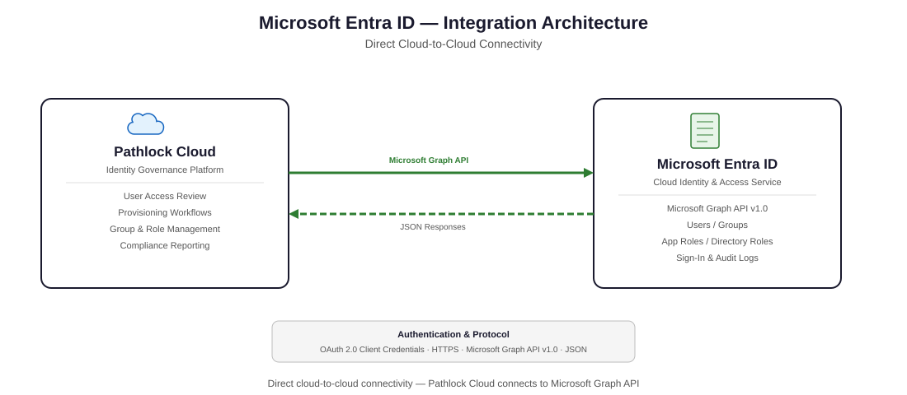

# 1. About This Guide
This guide provides detailed instructions for implementing and configuring the **Pathlock Connector for Microsoft Entra ID**. It consolidates official implementation guidance, configuration notes, and operational details.

The guide is intended for **technical users** who deploy, configure, and maintain the connector. Readers should be familiar with Microsoft Entra ID administration and Microsoft Graph concepts, including:

- Entra ID users, groups, and directory roles
- App registrations, client secrets, and application permissions
- Microsoft Graph endpoints and access control

## 1.1 Purpose
The purpose of this guide is to enable organizations to successfully integrate Pathlock Cloud with Microsoft Entra ID using the Entra ID connector. By following this documentation, implementation teams can:

- Configure secure authentication using application credentials and Microsoft Graph permissions.
- Synchronize users, groups, and directory roles into Pathlock Cloud for governance and reporting.
- Provision and deprovision users, assign and remove roles, and update user attributes.
- Validate connector functionality using the supported test operations and configuration checks.

## 1.2 Audience
This guide is written for technical professionals, including:

- **System Administrators** – Configure system parameters, manage connectivity, and maintain connector settings.
- **Microsoft Entra Administrators** – Manage app registrations, permissions, and directory role policies.
- **Identity and Access Management (IAM) Specialists** – Oversee provisioning, deprovisioning, access reviews, and SoD analysis.
- **Implementation and Support Teams** – Deploy the connector, troubleshoot issues, and work with Pathlock Support during resolution.

## 1.3 Conventions Used in This Guide
To help readers follow instructions consistently, this guide uses the following text conventions:

- **Bold** – Identifies user interface elements, navigation paths, and menu options.
- *Italic* – Refers to document titles or placeholder values that must be replaced with actual entries.
- Inline code – Highlights parameter names, command-line examples, or API endpoints.

---

# 2. Connector Overview
This section provides a concise overview of the connector’s scope, capabilities, and primary use cases.

- **Key Features**:
   - Synchronize Microsoft Entra ID users and groups into Pathlock Cloud.
   - Read and manage Microsoft Entra directory roles, including privileged roles.
   - Provisioning operations for users and role assignments.
- **Benefits**:
   - Centralized visibility of Entra users, groups, and directory roles in Pathlock Cloud.
   - Strengthen governance and reporting through improved role synchronization.
   - Support for provisioning and de-provisioning operations through standard connector operations.
- **Business Use Cases**:
   - Import Entra users and groups for governance and reporting.
   - Assign and remove Entra roles or groups from users.

---

# 3. Integration Architecture
This section outlines the logical flow of data and authentication for the connector based on documented endpoints and parameters.

- **High-level Architecture Diagram**
   
- **Data Flow**:
   - Authenticate Microsoft Entra ID using a registered client application (Application (client) ID and Application (client) secret).
   - Call Microsoft Graph API v1.0 endpoints to retrieve users and groups.
   - Map and synchronize returned data into Pathlock Cloud.
   - Execute provisioning operations (create, update, lock/unlock, role assignment) via supported operations.
- **Security Considerations**:
  - The connector requires Microsoft Graph application permissions listed in [Assign Permissions to the client application](#412-assign-permissions-to-the-client-application).
  - Admin consent must be granted for the configured permissions.

---

# 4. Prerequisites
This section lists prerequisites required to set up and operate the connector.

  - **Access/Permissions Needed**:
    - A Microsoft Entra ID tenant account with the Cloud Application Administrator role.
  - **Authentication & Authorization**:
    - A registered client application in Microsoft Entra ID.
    - A client secret for the registered application.
    - Microsoft Graph application permissions listed under [Assign Permissions to the client application](#412-assign-permissions-to-the-client-application).
  - **Dependencies**:
    - Microsoft Graph API version v1.0.

## 4.1 Registering a client application for integration
   This section describes how to register the client application used by the connector.

  1. Sign in to the Microsoft Entra admin center at https://entra.microsoft.com/.
  2. If you have access to multiple tenants, select **Settings** and switch to the tenant where you want to register the application from Directories + subscriptions menu.
  3. Go to **Identity** > **Applications** > **App registrations**, then select **New registration**.
  4. Enter a display name for the application.
  5. In **Supported account types**, choose who can use the application.
  6. Leave **Redirect URI** empty (optional).
  7. Select **Register** to complete the registration.
  8. In the **Overview** pane, copy and securely save the **Application (client) ID** and **Directory (tenant) ID**.

### 4.1.1 Create a client secret
   This section describes how to create the client secret used by the connector.

  1. Go to **Certificates & secrets** > **Client secrets**.
  2. Click **New client secret**.
  3. Enter a description and choose the expiration period.
  4. Click **Add**, then copy the secret from the **Value** column and store it securely.

### 4.1.2 Assign Permissions to the client application
   This section lists the Microsoft Graph permissions required for the connector.

  1. Go to **API permissions** > **Add a permission** > **Microsoft Graph** > **Application permissions**.
  2. Select these permissions:
      - Application.Read.All
      - Application.ReadWrite.All
      - AppRoleAssignment.ReadWrite.All
      - Group.Read.All
      - Group.ReadWrite.All
      - GroupMember.ReadWrite.All
      - User.ReadWrite.All
      - User-PasswordProfile.ReadWrite.All
      - User.ManageIdentities.All
      - UserAuthenticationMethod.ReadWrite.All
      - DelegatedPermissionGrant.ReadWrite.All
      - Directory.ReadWrite.All
      - RoleManagement.ReadWrite.Directory
      - RoleManagement.Read.All
      - User.Invite.All
      - Below authorizations are only required when using "Microsoft Entra Identity Governance" Integration.
         - EntitlementManagement.Read.All
         - EntitlementManagement.ReadWrite.All
  3. Click **Add permissions**.
  4. Click **Grant admin consent for [your tenant]**, then Click **Yes** to confirm.

---

# 5. Supported Systems and Versions
This section lists source and target systems supported by the connector.

- **Source System(s)**:
   - Microsoft Entra ID tenant.
- **Target System(s)**:
   - Pathlock Cloud v2026.1.0 or later.

---

# 6. Supported Operations, Features, & Capabilities
This section lists supported connector operations, core capabilities, and operational details.

- **Supported Operations**:

  **Standard Operations**

  | Operation | Supported |
  | --- | --- |
  | Read User List | ✅ |
  | Read Role List | ✅ |
  | Read User Role Assignments | ✅ |
  | Create User | ✅ |
  | Set User Properties | ✅ |
  | Lock User | ✅ |
  | UnLock User | ✅ |
  | Attach Role to User | ✅ |
  | Remove Role from User | ✅ |
  | GetChangedUsers | ✅ |

  **Custom Operations**

  | Operation | Supported |
  | --- | --- |
  | Assign License | ✅ |
  | Assign License with Disabled Plans | ✅ |
  | Remove License | ✅ |
  | Remove All Licenses | ✅ |
  | Get Group Owners | ✅ |
  | Get License Details | ✅ |
  | List Service Principals | ✅ |
  | List Service Principal Permissions | ✅ |
  | Remove Application Permission | ✅ |
  | Remove Delegated Permission | ✅ |
  | CreateGuestUser | ✅ |

  **Supported Test Operations**

   | Operation | Working | isCritical? |
   | --- | --- | --- |
   | Test Credentials Operation | Checks if we are able to get an access token | ✅ |
   | Test Read Users Operation | Fetches a few users to test the operation | ✅ |
  | Test Read Roles Operation | Fetches a few roles to test the operation | ✅ |
  | Test Read Child Roles Operation | Fetches a few child roles to test the operation | ✅ |
  | Test Verify Read Permissions Operation | Checks and verifies the presence of necessary read permissions mentioned in [Assign Permissions to the client application](#412-assign-permissions-to-the-client-application). | ✅ |
  | Test Verify Write Permissions Operation | Checks and verifies the presence of necessary write permissions mentioned in [Assign Permissions to the client application](#412-assign-permissions-to-the-client-application). | ❌ |

   > Notes
   - All tests above are marked as **critical**. If all critical tests pass, the connector is considered working.
   - Success and failure messages are configured for each test in `Test_OperationList.xml`.
   - Test definitions are managed in `ConnectionTest/Test_OperationList.xml` and mapped in `Mapping.xml`.

- **Core Functionality**:
  - Read users, groups, and directory roles.
  - Assign and remove groups and directory roles for users.
  - Create and update users, including password management.
- **Optional/Advanced Features**:
  - Manage service principal permissions and licenses.
  - Create guest users through invitations.
- **Feature-Specific Limitations**:
  - Directory role operations apply only to User type objects and do not support adding privileges to Groups and Applications/Service Principals.
  - Microsoft 365 and Distribution groups are mail-enabled and cannot be assigned to or removed from users.

## 6.1 Privilege Access
This connector supports **Read**, **Assign**, and **De-assign** Directory Roles (Microsoft Entra Roles).

> NOTE: Operations in this section apply only to user objects. They do not support assigning directory roles to groups or applications/service principals.

- **Read Role List**:
  Reads all groups and directory roles in Microsoft Entra. Directory roles are shown with the _PRIV_ prefix. Some roles are marked as **Privileged**; the rest are labeled **Directory**.

- **Get User Roles**
  - **Mandatory Parameters**:
    - Username
  - Fetch all groups and directory roles assigned to the user (active assignments only).

- **Attach Role To User**
  - **Mandatory Parameters**:
    - UserName
    - RoleName
  - Assigns the specified group or directory role to the user.

- **Remove Role From User**
  - **Mandatory Parameters**:
    - UserName
    - RoleName
  - Removes the specified group or directory role from the user.

## 6.2 Application Access
This section documents non-human identity operations for service principals and permissions.

- **List Service Principals**: Lists all service principals in the Entra tenant, including applications, managed identities, and legacy service principals.

- **List Service Principal Permissions**
  - **Mandatory Parameters**
    | Parameter | Description | Example |
    | --- | --- | --- |
    | AppName | ApplicationName (same as in Service Principal List) | Test_Application |

- **Remove Application Permissions**
  - **Mandatory Parameters**
    | Parameter | Description | Example |
    | --- | --- | --- |
    | AppName | ApplicationName (same as in Service Principal List) | Test_Application |
    | Permission | Permission to be removed (same as in Service Principal Permission List) | User.Read.All (Application) |

- **Remove Delegated Permissions**
  - **Mandatory Parameters**
    | Parameter | Description | Example |
    | --- | --- | --- |
    | AppName | ApplicationName (same as in Service Principal List) | Test_Application |
    | Permission | Permission to be removed (same as in Service Principal Permission List) | User.Read.All (Delegated) |

> **NOTE:** Removing a permission (application or delegated) deletes it from all resources where it appears. For example, If User.Read.All (Application) is granted in both Microsoft Graph and SharePoint Online, running the Remove Application Permission operation will remove it from both resources.

## 6.3 Other Operation Details
This section documents operation-specific parameters and behaviors.

### 6.3.1 Set User Password
- **Mandatory Parameters**:
  - username
  - password
- Sets the new password and sets ForceChangePasswordNextSignIn to true.
- To set a new password without forcing a reset at next sign-in, call **Update User** with:
  - passwordProfile_password : new password
  - passwordProfile_forceChangePasswordNextSignIn : false

### 6.3.2 Update User
- **Mandatory Parameters**:
  - username ( UserPrincipalName )
- **Optional Parameters**:
  - Any simple user attribute can be specified as user_[attributeName]. A simple user attribute is not a collection or child object.
    - For a list of properties, see https://learn.microsoft.com/en-us/graph/api/resources/user?view=graph-rest-1.0#properties
    - For example, to set the department field, pass the parameter user_department to the operation.
  - Child objects can be specified by using the child object name, followed by an underscore (_) and the attribute name.
    - The following child objects are supported:
      - onPremisesExtensionAttributes
      - onPremisesSipInfo
      - cloudRealtimeCommunicationInfo
      - identities
    - Examples:
      - To set extensionAttribute1, pass the parameter onPremisesExtensionAttributes_extensionAttribute1 to the operation.
      - To set sipPrimaryAddress, pass the parameter onPremisesSipInfo_sipPrimaryAddress to the operation.

### 6.3.3 Create User
- **Mandatory Parameters**:
  - username ( UserPrincipalName )
  - password
- **Optional Parameters**:
  - DisplayName
  - ForceChangePasswordNextSignIn, true or false. Default value is false.
  - Any simple user attribute can be specified as user_[attributeName]. A simple user attribute is not a collection or child object.
    - For a list of properties, see https://learn.microsoft.com/en-us/graph/api/resources/user?view=graph-rest-1.0#properties
    - For example, to set the department field, pass the parameter user_department to the operation.
  - Child objects can be specified by using the child object name, followed by an underscore (_) and the attribute name.
    - The following child objects are supported:
      - onPremisesExtensionAttributes
      - onPremisesSipInfo
      - cloudRealtimeCommunicationInfo
      - identities
    - Examples:
      - To set extensionAttribute1, pass the parameter onPremisesExtensionAttributes_extensionAttribute1 to the operation.
      - To set sipPrimaryAddress, pass the parameter onPremisesSipInfo_sipPrimaryAddress to the operation.

### 6.3.4 Create Guest User
**API Endpoint**: /invitations

| Parameter | Description | Required (Y/N) ? |
| --- | --- | --- |
| UserName | User's Firstname and Lastname in Microsoft Entra | ✅ Yes |
| Email Address | User's Business Email ID in Microsoft Entra | ✅ Yes |
| Email Message | Custom message included in the guest user’s invitation email. | ✅ Yes |

> **NOTE:** Assign the User.Invite.All Permissions to the client application.

### 6.3.5 Assign License
- **Mandatory Parameters**:
  - userid ( UserPrincipalName )
  - skuId

### 6.3.6 Assign License with Disabled Plans
- **Mandatory Parameters**:
  - userid ( UserPrincipalName )
  - skuId
  - disabledPlans : comma-separated list of plan IDs to disable, each value wrapped in double quotes.
    - example : "plan1", "plan2"

### 6.3.7 Remove License
- **Mandatory Parameters**:
  - userid ( UserPrincipalName )
  - skuId

### 6.3.8 Remove All Licenses
- **Mandatory Parameters**:
  - userid ( UserPrincipalName )

### 6.3.9 Get License Details
- Returns all available licenses and their plans.
- Requires API permissions such as LicenseAssignment.ReadWrite.All or LicenseAssignment.Read.All.
- **Optional Parameters**:
  - licenseFilter : Only return licenses that contain this text. Leave blank for all licenses

### 6.3.10 Get Group Owners
- No parameters.
- Returns all owners for all groups.

## 6.4 Usage
Run **Test Connection** from PLC to execute all configured tests and verify connector functionality for all major operations.  
If all critical tests succeed, the connector is assumed to be configured and working correctly.

---

# 7. Connector Installation

This section describes the available connector installation methods based on your Pathlock Cloud version and provides a high-level overview of the steps.

## 7.1 Installation Methods
The connector supports two installation methods:

- **Source Onboarding (Marketplace)** – Available in Pathlock Cloud v2025.5.0 or later.
- **Classic Installation (Manual Connector Package Upload)** – Used when Source Onboarding is not available (Pathlock Cloud versions earlier than v2025.5.0). For detailed procedure, see [Classic installation (Manual Connector Package Upload)](#142-classic-installation-manual-connector-package-upload--for-pathlock-cloud-versions-earlier-than-v202550) under Appendix.

## 7.2 Source Onboarding (Marketplace) – Pathlock Cloud v2025.5.0+
Use the Installation Wizard to create and configure a new Source through the Marketplace.
This option launches a guided setup, which walks you step by step through the required configuration and validation process.

To start Source Onboarding, follow these steps.

1. Go to **Admin** > **Connectivity Hub** > **Marketplace**.
2. On the **Licensed** tab, locate and expand the connector card.
3. Click **Installation Wizard**.

The **Guided Setup** opens.

**Guided Setup steps**

1. Select **Deployment Type**.
    - Enter the **Source Name** and select the deployment type **On-cloud**. 
    - Click **Save & Continue**
2. **Connection & Authentication**
    - Enter the required connection and authentication parameters. For details, see [Connection Parameters](#8-connection-parameters). 
    - Click **Save & Continue**
3. **Additional Configuration**
    - Configure any connector-specific parameters. For details, see [Connection Parameters](#8-connection-parameters). 
    - Click **Save & Continue**
4. **Test Connection**
    - Click **Test Connection** to validate connectivity to the Source.
5. **Review**
    - Review the configuration summary and confirm the connection status.

Select **Finish** to complete onboarding.

The configured Source is created in **Active** status and can be accessed from **Admin** > **Connectivity Hub** > **Sources**.

----

# 8. Connection Parameters
This section lists the connector connection parameters and their descriptions.

| Parameter | Description |
| --- | --- |
| Username | Mention the Application (client) ID. See, [Register a client application](#41-registering-a-client-application-for-integration) section. |
| Password | Mention the Application (client) Secret. See, [Create a client secret](#411-create-a-client-secret) section. |
| Graph API version | The Graph API Version. Use value "v1.0". |
| Tenant ID | Mention the Directory (tenant) ID. See, [Create a client secret](#411-create-a-client-secret) section. |
| Read Access Packages | Set this value to Yes to synchronize [Microsoft Entra Identity Governance Access Packages](#101-microsoft-entra-identity-governance-access-packages) into Pathlock Cloud as roles. |
| Entra IG Policy Template name | This parameter is only relevant when using "Microsoft Entra Identity Governance" Integration. See -> [Microsoft Entra Identity Governance Integration](#102-microsoft-entra-identity-governance-integration) |

# 9. Synchronize Pathlock Microsoft Entra ID Connector with Pathlock

This subsection explains how to schedule and run synchronization for the configured Pathlock Microsoft Entra ID Source so Pathlock Cloud can ingest and reconcile connector data.
1. Complete all five steps in the connector setup wizard.  
2. Navigate to **Admin → Connectivity Hub → Sources**.  
3. Locate the created source and verify that its status is **Successfully Completed**.  
4. Click the **Expand** icon next to the completed source.  
5. Go to the **Process Schedule** tab.  
6. Click **Actions → New** to create a new synchronization schedule.  
7. In the configuration window, configure the schedule.  
   Select **Source** from the dropdown.  
   Choose the **Process**, such as *Synchronize Users*, *Synchronize Roles*, or *Synchronize Authorizations*.  
   Set the desired **Time Interval** for the process, such as *Daily*, *Weekly*, or *Custom*.  
8. Click **Save** to activate the synchronization schedule.  
  The selected synchronization process runs automatically at the configured intervals.

---

# 10. Security Model Mapping
This section maps Microsoft Entra objects to Pathlock Cloud security objects.

- **Users**: Users in Microsoft Entra ID.
- **Roles**:
  - Groups in Microsoft Entra ID
    - Security: Security groups can be assigned to or removed from users.
    - Microsoft 365: Mail-enabled groups; cannot be assigned to or removed from users.
    - Distribution: Mail-enabled groups; cannot be assigned to or removed from users.
  - Directory roles (Microsoft Entra roles)
    - Displayed with the **PRIV** prefix and used to grant privileged access to Entra resources.

> **Notes**:
> - Default group prefix values:
>  - DistributionGroup = DIST:
>  - Microsoft365Group = M365:
>  - SecurityGroup = SEC:
> - To update these values, open variable.txt and modify the prefix entries.

| Level | Description | Read /SOD | Provision | Usage Log |
| --- | --- | --- | --- | --- |
| Level 1 | Group: Security | ✅ | ✅ |  |
| Level 1 | Group: Microsoft 365 | ✅ | ✅ |  |
| Level 1 | Group: Distribution | ✅ |  |  |
| Level 2 | Role: Directory | ✅ | ✅ |  |
| Level 2 | Role: Privileged | ✅ | ✅ |  |

## 10.1 Microsoft Entra Identity Governance Access Packages
By enabling this feature, _Access Packages_ from Microsoft Entra Identity Governance are loaded as roles in Pathlock Cloud.

These roles have the prefix _AP:_ and contain the Access Package Catalog name followed by a _/_ and the Access Package name.

**Example Access Package names**

Access Catalog : Finance
Access Package : Controller
Pathlock Role Name : AP:Finance/Controller

**Enabling**

Set system parameter **Read Access Packages** to **Yes**.

**Access Packages as Cross System Composite roles in Pathlock Cloud**

Access Packages can contain resource roles in Applications defined in Entra ID. If those Applications are also defined in Pathlock Cloud as systems, the Access Packages can be loaded as cross system composite roles.

To link the App name in Microsoft Entra ID to the System in Pathlock Cloud, enter the Display Name of the Entra ID App in the field _CUA - Rfc Destinations_ of the System in Pathlock Cloud.

> **Menu Path:** Admin > Technical Configuration > Connected Systems > Systems

## 10.2 Microsoft Entra Identity Governance Integration
This section is only relevant when provisioning requests for Access Packages are done from Microsoft Entra Identity Governance, and Pathlock Cloud Business roles are published to Microsoft Entra Identity Governance.

### Create a Policy Template
- In any _Access Package_, in any _Access Package Catalog_, create a Policy that will be used as a template for all _Access Packages_ published by Pathlock Cloud.
- Configure the policy name in system parameter **Entra IG Policy Template name**.
- This policy does not need to be active; it ensures all _Access Packages_ have the correct configuration settings and request forms.

---

# 11. Field Mapping Information
This section shows how Pathlock Cloud fields map to Microsoft Graph API fields.

## 11.1 Users
**API Endpoint**: /users

| Pathlock Cloud Field | API Field | Notes |
| --- | --- | --- |
| UserName | userPrincipalName | User principal name in Entra |
| FullName | displayName | User display name in Entra |
| EMail | mail | Business email address |
| CreateDate | createdDateTime | Account creation timestamp |
| PasswordChangedDate | lastPasswordChangeDateTime | Last password change timestamp |
| LockStatus | accountEnabled | If LockStatus is True, the user is active |
| ApiIdentifier | id | Entra user object ID |
| UserType | userType | User type in Entra |
| Company | companyName | Company name |
| City | city | City |
| Building | building | Building |
| Country | country | Country |
| Department | department | Department |

## 11.2 Roles

### 11.2.1 Groups
**API Endpoint**: /groups

| Pathlock Cloud Field | API Field | Notes |
| --- | --- | --- |
| RoleName | displayName | Group name in Entra |
| RoleAttribute1 | id | Group ID |
| CreateDate | createdDate | Group creation date |
| Description | description | Group description |
| CustomRoleType | GroupType | Group type in Entra |
| RoleAttribute2 | MailEnabled | Whether the group is mail-enabled in Exchange |
| RoleAttribute3 | SecurityEnabled | Whether the group can be used for access/permission assignments |

---

# 12. Best Practices
This section provides recommended implementation practices.

- Ensure all listed Microsoft Graph application permissions are granted and admin consent is completed.
- Use the documented client application registration steps and securely store the client secret.

---

# 13. Known Limitations
This section lists documented limitations.

- Directory role operations are valid only for User type objects; privileges for Groups and Applications/Service Principals are not supported.
- Microsoft 365 and Distribution groups are mail-enabled and cannot be assigned to or removed from users.

---

# 14. Appendix
This section provides additional information.

## 14.1 Glossary
**Access Token**: A short-lived token issued by Microsoft Entra ID that the connector uses to call Microsoft Graph APIs.

**Admin Consent**: Tenant-wide approval required for application permissions in Microsoft Graph.

**Application (Client) ID**: The unique identifier of the registered client application in Microsoft Entra ID.

**Application (Client) Secret**: A credential generated for the client application and used for authentication.

**Application Permissions**: Permissions granted to an application to access Microsoft Graph without a signed-in user.

**Client Application**: The Microsoft Entra ID app registration used by the connector to authenticate and access APIs.

**Connector**: The Pathlock integration package that reads and provisions Microsoft Entra ID data.

**Directory (Tenant) ID**: The unique identifier of the Microsoft Entra ID tenant.

**Directory Role**: A built-in Microsoft Entra role used to grant administrative privileges; shown with the PRIV prefix in Pathlock.

**Group**: A Microsoft Entra object used to organize users and assign access. Types include Security, Microsoft 365, and Distribution groups.

**Microsoft Graph API**: The REST API used by the connector to read and manage Entra objects.

**Provisioning**: Operations that create, update, lock/unlock, or assign/remove roles for users.

**Service Principal**: The tenant representation of an application or managed identity in Microsoft Entra ID.

**Synchronization**: The process of importing users, groups, and roles from Microsoft Entra ID into Pathlock Cloud.

**Test Connection**: A validation step that runs configured test operations to confirm connectivity and required permissions.

**User Principal Name (UPN)**: The user login identifier used in Microsoft Entra ID, often in the form user@domain.

## 14.2 Classic Installation (Manual Connector Package Upload) – For Pathlock Cloud versions earlier than v2025.5.0

Use the Classic Installation method if your Pathlock Cloud version does not support Source Onboarding.
This method requires manual configuration and validation steps.

**Typical process**

1. Create the **Target System**.
2. Go to **Admin** > **Technical Configuration** > **Connected Systems** > **Systems**.
3. On the **Systems** page, click the **New Record** tab, and add a **Name** for your system and select the **System Type** from dropdown.
4. Upload the **Connector Package**
   - **On-Cloud deployments**
        - Go to **Admin** > **Technical Configuration** > **Connected Systems** > **Systems**.
        - Select the **Connector** tab and choose **Upload Package**.
   - **Cloud-to-on-premises deployments**
        - In the Pathlock Cloud Agent, select **Load Connector**.
5. Configure **System and Connection Parameters**. For details, see the [Connection Parameters](#8-connection-parameters).
   - **On-Cloud deployments**
        - Go to **Admin** > **Technical Configuration** > **Connected Systems** > **System Parameters**.
   - **Cloud-to-on-premises deployments**
        - In the Pathlock Cloud Agent, go to **System** > **[System Name]** > **System Parameters**.
6. **Validate Connectivity**.
    - Go to **Admin** > **Technical Configuration** > **Connector Configuration – Test**.
7. Run the **Test Connection** operation for the selected system.

**Characteristics**

- Manual configuration and validation steps
- Suitable when Marketplace-based Source Onboarding is not available

## 14.3 Synchronize the Microsoft Entra ID System with Pathlock

1. Log in to the Pathlock application.  
2. Navigate to **Admin > System Settings > Pathlock Processes > Pathlock Process Overview**.  
   The Pathlock Process Overview screen is displayed.  
3. Schedule the synchronizing processes in the following order: -  
   a. Synchronize Descriptions.  
   b. Synchronize Users.  
   c. Synchronize Roles.  
   d. Synchronize Authorizations.  
   e. Rebuild Users Catalog  
4. Click **Settings** for each synchronization process (Synchronize Descriptions, Synchronize Users, Synchronize Roles, and Synchronize Authorizations) and follow these steps:  
   a. Select **Run Now Per System**.  
      The System Selection popup window is displayed.  
    b. Select the system from the list of systems.  
   c. Click **Run Selected Processes**.  
5. Click **Refresh**.  

### 14.3.1 Verify Initial Synchronization Results

To verify whether the data of the application is synchronized with the Pathlock application, follow these steps:

1. Log in to the Pathlock Cloud application.  
2. Navigate to **Reports > Report Designer**.  
   The Report Designer screen is displayed.  
3. On the Parameters screen, under the User section, in the Query Design section, add filters for the recently synchronized system.  
   a. From the Main Object list, select **User**.  
   b. From the Result list, select **Role to User**.  
4. Click **Display**.  

If all the users of the connected application and assigned roles are displayed, consider that the initial synchronization is verified.

**Additional Considerations**
- If Usage Logging is supported, run Recover Usage Logging until there is activity in the target system.
- If Change Logging is implemented, run the Change Document Test workflow and ensure the results are generated correctly in the Data Changes Monitoring report.

----

# 15. Support & Contact Information

This section provides the official support contact details.

For technical or product support, contact **Pathlock Support**:  
📧 **support@pathlock.com**  
🌐 [https://www.pathlock.com/support](https://www.pathlock.com/support)

----
